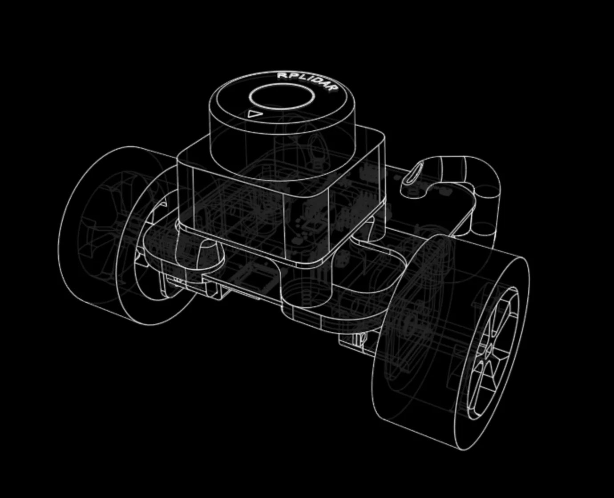

<pre style="text-align: center">
         ┓            ┏         
░░░░░▒▒▒▓┃ ┳┳┓┏┓┏┳┓┏┓ ┃▓▒▒▒░░░░░
░░░░░▒▒▒▓┃ ┃┃┃┃┃ ┃ ┣  ┃▓▒▒▒░░░░░
░░░░░▒▒▒▓┃ ┛ ┗┗┛ ┻ ┗┛ ┃▓▒▒▒░░░░░
         ┛            ┗         
</pre>

 The low-cost, high-reliablity mobile robot for hands-on robotics education. 

 
 

    
    

    <iframe src="https://app.rerun.io/version/0.34.1/index.html?url=https://empriselab.github.io/mote/getting_started/assets/hello_world/mote-link-example-roaming.rrd" width="100%" style="aspect-ratio: 1.5;"></iframe>

## Highlights

* LiDAR, IMU, and wheel position data streamed over WiFi
* Polished SDKs for ROS, ROS2, Python and Rust
* Wide cross-platform support
* Open source firmware, software, and hardware
* Only $100

## Getting Started

[Assemble your kit](./getting_started/kit-assembly.md) if you already have the parts, or checkout the [hardware sourcing guide](./hardware-sourcing/acquire.md) if you're starting from scratch.
