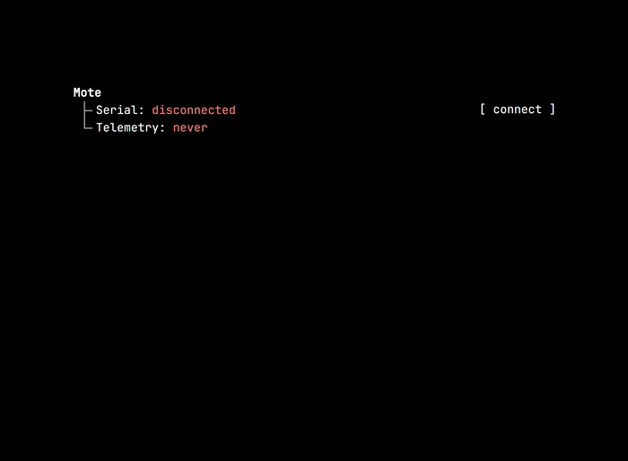

# Configuration

This page will guide you through setting up your Mote for the first time.

## Connecting to WiFi

Mote communicates using WiFi. In order to work with Mote, we will log it onto a WiFi network.

1. Connect Mote to your computer using a USB-C cable.

2. Open [the Mote configuration page](../configuration). Click `[ connect ]` and select "Mote Serial".

3. Locate your WiFi network under "Networks". Click `[ connect ]` and enter your WiFi password. If you are using a public network, leave this field blank.

4. Press enter.

5. Wait 30 seconds for Mote to connect to the network. When the robot has successfully connected, you will see "currently connected" next to your WiFi in the detected networks list.

6. Under "Identification", take note your Mote's IP. You will need the IP later to establish communication with your robot.

## Give Your Mote a Name

You can use a friendly name to communicate with your Mote.

1. Connect Mote to your computer using a USB-C cable.

2. Open [the Mote configuration page](../configuration). Click `[ connect ]` and select "Mote Serial".

3. Next to "Unique Identifier", click `[ update ]`. 

4. Enter your Mote's name in the box. 

5. Press enter.

> [!IMPORTANT]
> Only one Mote can have a given name on a single network. If you expect other Motes to be used on the same network, choose a name that is unique enough to prevent conflicts.

## Next Steps

* [Hello World](./hello-world.md) - learn how to connect to your robot.

## Troubleshooting

### My network doesn't appear

Mote can only connect to 2.4 GHz networks. Make sure your router has the 2.4 GHz band enabled.

