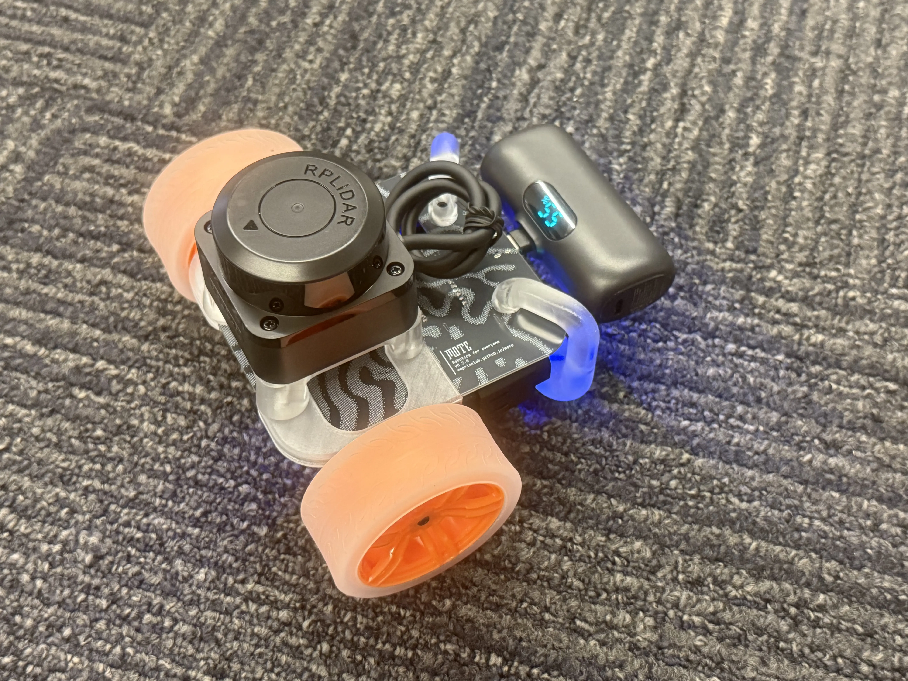

# Hello World

In this example we'll use the mote-link Python library to control Mote and visualize telemetry data.

<div class="desktop-only">
    <iframe src="https://app.rerun.io/version/0.34.1/index.html?url=https://empriselab.github.io/mote/getting_started/assets/hello_world/mote-link-example-roaming.rrd" width="100%" style="aspect-ratio: 1.5;"></iframe>

*Example data - Mote driving around my apartment*
</div>

<!-- <iframe src="https://app.rerun.io/version/0.34.1/index.html?url=http://localhost:8080/getting_started/assets/hello_world/mote-link-example-roaming.rrd" width="100%" style="aspect-ratio: 1.5;"></iframe> -->

## Setup

This example uses [uv](https://docs.astral.sh/uv/) to run a Python program. Install uv using the instructions in the [uv docs](https://docs.astral.sh/uv/getting-started/installation/).

Attach the battery to your Mote. Place your Mote on the ground with enough space for it to move around.



## Running the mote-link Demo

In the terminal of your choice, run the demo.

```bash
uvx --from 'mote-link[demo]' rerun-demo
```

Follow the instructions in your terminal to select and connect to your Mote. 

Once connected, your browser will open to a dashboard showing realtime LiDAR, wheel encoder, accelerometer, and gyroscope data.

Use the arrow keys to drive Mote around.

> [!TIP]
> If you know your robot's [name](./configuration.html#give-your-mote-a-name) or [ip address](./configuration.html#give-your-mote-a-name), you can skip waiting for autodiscovery by passing it in as an argument:
>
> `uvx --from 'mote-link[demo]' rerun-demo --ip 192.168.XX.XX` or 
> 
> `uvx --from 'mote-link[demo]' rerun-demo --name my-awesome-name`


## Next Steps

* [Python guide]() - learn how to write your own Python scripts for interfacing with Mote.
* [The Rust guide]() - like the Python guide, but using Rust 🦀.
* [The ROS 2 guide]() - learn how to use Mote with the Robot Operating System.

## Troubleshooting

### "Could not find Motes using autodiscovery"

Your network has mDNS disabled. This is common practice for public and corporate networks.
You can connect directly to your Mote via it's IP.

1. Connect the robot to your computer using a USB-C cable

2. Open [the Mote configuration page](../configuration).

3. Note the IP provided under "Identification".

4. Pass the IP into the demo command

```bash
uvx --from 'mote-link[demo]' rerun-demo --ip <IP from the configuration page>
```

Be aware that Mote's IP may change between sessions. If that happens, check the [configuration page](../configuration) for the new IP.

### My Mote drives backwards

[Check your motor cable connections](./kit-assembly.html#cables). Are the left and right motor connections swapped?
